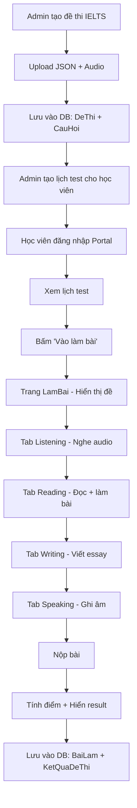

# Kế hoạch xây dựng hệ thống thi online IELTS

## Tổng quan

Dựa trên phân tích hệ thống hiện tại, project đã có nền tảng tốt:
- ✅ Backend: [`examController.js`](backend/src/controllers/examController.js) - API tạo đề, import JSON, làm bài, nộp bài
- ✅ Backend: [`testController.js`](backend/src/controllers/testController.js) - Quản lý lịch hẹn test
- ✅ Backend: Models trong [`ExamModels.js`](backend/src/models/ExamModels.js) - DeThi, CauHoi, KetQuaDeThi, BaiLam
- ✅ Frontend: [`LamBai.js`](frontend/src/pages/LamBai.js) - Trang làm bài thi
- ✅ Frontend: [`HocVienTestPortal.js`](frontend/src/pages/HocVienTestPortal.js) - Portal học viên xem lịch test
- ⚠️ Cần bổ sung: Import từ PDF, tích hợp Listening audio, cải thiện UX

---

## Các bước thực hiện

### Bước 1: Tạo template JSON chuẩn cho đề thi IELTS 4 kỹ năng

**Mục tiêu:** Tạo file template để admin có thể tạo đề thi theo format chuẩn

**Thực hiện:**
- Tạo file `ielts_4skills_template.json` với cấu trúc:
  - Listening (4 parts, nhiều loại câu hỏi)
  - Reading (2 passages, True/False/MCQ/Fill in blank)
  - Writing (2 tasks - Task 1 + Task 2)
  - Speaking (3 parts - cue card, discussion)

**File cần tạo:**
```
backend/uploads/templates/ielts_4skills_template.json
```

---

### Bước 2: Tạo công cụ import đề thi IELTS từ PDF có sẵn

**Mục tiêu:** Chuyển đổi file PDF đề thi IELTS có sẵn thành câu hỏi trong hệ thống

**Hai phương án:**

**Phương án A (Khuyến nghị):** Dùng script tay để nhập câu hỏi
- Sử dụng template JSON đã tạo ở Bước 1
- Admin nhập câu hỏi theo format → upload lên hệ thống

**Phương án B:** Nếu có nhiều PDF cần chuyển đổi
- Tạo script Node.js để parse PDF và extract câu hỏi
- Cần thư viện `pdf-parse` hoặc `pdf2json`

**File cần tạo/sửa:**
```
backend/add_ielts_reading.js  (script import đề thi IELTS)
```

---

### Bước 3: Nâng cấp trang quản lý đề thi trong admin

**Mục tiêu:** Admin có thể tạo/sửa/xóa đề thi IELTS dễ dàng

**Cần cải thiện file [`QuanLyDeThi.js`](frontend/src/admin/lms/QuanLyDeThi.js):**
- Thêm form tạo đề thi IELTS với 4 kỹ năng
- Upload file JSON template
- Upload file audio listening
- Upload file PDF đề gốc (nếu cần)
- Hiển thị danh sách câu hỏi sau khi tạo đề
- Cho phép chỉnh sửa câu hỏi

**API endpoints cần kiểm tra:**
- `POST /api/exam/de-thi` - Tạo đề mới
- `POST /api/exam/de-thi/upload-json` - Import từ JSON
- `GET /api/exam/de-thi/:id` - Lấy chi tiết đề
- `PUT /api/exam/de-thi/:id` - Cập nhật đề
- `DELETE /api/exam/de-thi/:id` - Xóa đề

---

### Bước 4: Kiểm tra và tối ưu API làm bài thi

**Mục tiêu:** Đảm bảo API hoạt động đúng cho cả 4 kỹ năng

**Cần kiểm tra trong [`examController.js`](backend/src/controllers/examController.js):**

1. **API bắt đầu làm bài** - `batDauLamBai`:
   - Kiểm tra lấy đúng câu hỏi không có đáp án đúng
   - Kiểm tra trả về file audio nếu có

2. **API trả lời câu** - `traLoi`:
   - Kiểm tra so sánh đáp án đúng/sai
   - Kiểm tra tính điểm đúng

3. **API nộp bài** - `nopBai`:
   - Tính điểm từng phần (Listening, Reading)
   - Tính điểm Writing (nếu có) - cần note: Writing cần chấm thủ công
   - Trả về chi tiết từng câu

---

### Bước 5: Cải thiện giao diện làm bài cho học viên (LamBai.js)

**Mục tiêu:** Tạo trải nghiệm làm bài tốt nhất cho học viên

**Cần cải thiện trong [`LamBai.js`](frontend/src/pages/LamBai.js):**

1. **Hiển thị tabs 4 kỹ năng:**
   ```javascript
   const tabs = [
     { id: "nghe", label: "Listening", icon: "👂" },
     { id: "doc", label: "Reading", icon: "📖" },
     { id: "viet", label: "Writing", icon: "✍️" },
     { id: "noi", label: "Speaking", icon: "🗣️" }
   ];
   ```

2. **Tích hợp Audio Player cho Listening:**
   - Player audio ở đầu phần Listening
   - Hỗ trợ phát lại
   - Hiển thị progress

3. **Mở PDF trong tab mới:**
   - Hiện tại: mở trong tab hiện tại → nên mở tab mới
   - Cho phép học viên vừa xem PDF vừa làm bài

4. **Writing Section:**
   - Text editor đơn giản cho viết essay
   - Đếm số từ (yêu cầu tối thiểu 250 từ)
   - Lưu tạm vào localStorage

5. **Speaking Section:**
   - Ghi âm bằng MediaRecorder API
   - Upload file audio lên server

6. **Countdown timer:**
   - Hiển thị thời gian còn lại
   - Tự động nộp bài khi hết giờ
   - Cảnh báo khi còn 5 phút

7. **Progress sidebar:**
   - Hiển thị số câu đã trả lời mỗi phần
   - Click để nhảy đến câu cụ thể
   - Màu sắc: đã trả lời (xanh), chưa trả lời (trắng)

---

### Bước 6: Tạo trang portal cho học viên xem lịch và làm bài online

**Mục tiêu:** Học viên có thể đăng nhập và làm bài online

**Cần cải thiện trong [`HocVienTestPortal.js`](frontend/src/pages/HocVienTestPortal.js):**

1. **Thêm nút "Bắt đầu làm bài" khi có lịch test:**
   - Kiểm tra trạng thái lịch test
   - Nếu chưa làm → hiển thị nút "Vào làm bài"
   - Chuyển sang trang LamBai

2. **Kết nối với trang làm bài:**
   - Sử dụng component LamBai
   - Pass deThiId và lichHenTestId

3. **Xem kết quả sau khi nộp bài:**
   - Hiển thị điểm từng phần
   - Link xem chi tiết

---

### Bước 7: Tích hợp audio file cho phần Listening

**Mục tiêu:** Học viên có thể nghe audio và làm bài Listening

**Kiểm tra trong [`examController.js`](backend/src/controllers/examController.js):**
- Trường `file_audio` trong model DeThi đã có
- API upload file audio: `req.files?.file_audio`

**Cần đảm bảo:**
1. Admin có thể upload file audio khi tạo đề
2. Frontend hiển thị player audio đúng cách
3. File audio được lưu trong `backend/uploads/`

**Nếu chưa có file audio:**
- Sử dụng file mẫu trong `backend/uploads/Audio-20260417T091107Z-3-001/Audio/`
- Hoặc tìm file IELTS Listening sample

---

### Bước 8: Kiểm tra toàn bộ flow hoạt động

**Mục tiêu:** Đảm bảo toàn bộ flow hoạt động trơn tru

**Flow hoàn chỉnh:**



**Test cases cần kiểm tra:**
1. ✅ Admin tạo đềIELTS từ JSON template
2. ✅ Admin upload file audio
3. ✅ Học viên đăng nhập portal
4. ✅ Học viên xem danh sách lịch test
5. ✅ Học viên bắt đầu làm bài
6. ✅ Học viên trả l���i câu hỏi Listening
7. ✅ Học viên trả lời câu hỏi Reading
8. ✅ Học viên nộp bài
9. ✅ Hiển thị kết quả điểm
10. ✅ Xem chi tiết từng câu

---

## Giải thích kỹ thuật

### Cấu trúc data

**Dề thi IELTS 4 kỹ năng:**
```json
{
  "ten_de": "IELTS Full Test 4 Skills - 2024",
  "mo_ta": "Đề thi IELTS đầu vào 4 kỹ năng",
  "loai": "ielts",
  "thoi_gian_phut": 150,
  "ky_nang": [
    {
      "ten": "Listening",
      "bai_tap": [
        {
          "id": "L1",
          "loai": "mcq",
          "audio": "ielts_listening_part1.mp3",
          "cau_hoi": [...]
        }
      ]
    },
    {
      "ten": "Reading",
      "bai_tap": [...]
    },
    {
      "ten": "Writing",
      "bai_tap": [...]
    },
    {
      "ten": "Speaking",
      "bai_tap": [...]
    }
  ]
}
```

### Loại câu hỏi hỗ trợ

| Loại | Mô tả | Ví dụ |
|------|-------|-------|
| `mcq` | Multiple Choice | A/B/C/D |
| `true_false` | True/False/Not Given | T/F/NG |
| `fill_blank` | Điền từ | "London is the ___ of UK" |
| `matching` | Nối tương ứng | Match headings |
| `essay` | Viết luận | Writing Task 2 |
| `recording` | Ghi âm | Speaking |

---

## Ưu tiên các bước

**Giai đoạn 1 - Cơ bản (cần làm ngay):**
1. ✅ Bước 1: Tạo template JSON
2. ✅ Bước 3: Nâng cấp admin quản lý đề thi
3. ✅ Bước 5: Cải thiện trang làm bài

**Giai đoạn 2 - Nâng cao:**
4. 🔄 Bước 7: Tích hợp audio Listening
5. 🔄 Bước 6: Portal học viên

**Giai đoạn 3 - Hoàn thiện:**
6. ⏳ Bước 4: Tối ưu API
7. ⏳ Bước 8: Kiểm tra toàn bộ flow
8. ⏳ Bước 2: Import từ PDF (nếu cần)

---

## Lưu ý quan trọng

1. **Writing & Speaking chấm thủ công:** 
   - Hiện tại hệ thống tự động chấm được Listening + Reading
   - Writing & Speaking cần admin chấm thủ công sau khi học viên nộp bài

2. **License file audio:** 
   - Cần có license hợp lệ nếu sử dụng file audio thương mại

3. **PDF đề thi:** 
   - Nên giữ lại file PDF gốc để học viên tiện tham khảo

4. **Thời gian thi IELTS chuẩn:**
   - Listening: 30 phút
   - Reading: 60 phút
   - Writing: 60 phút
   - Speaking: 11-14 phút

---

Bạn có muốn tôi bắt đầu thực hiện từ bước nào trước không?